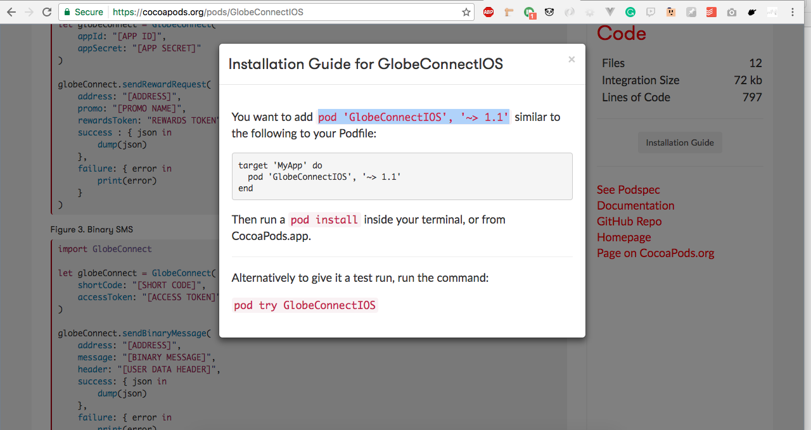
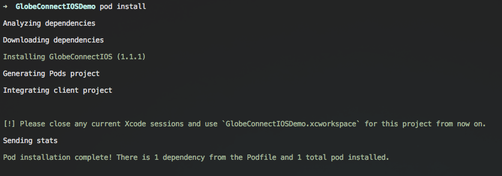
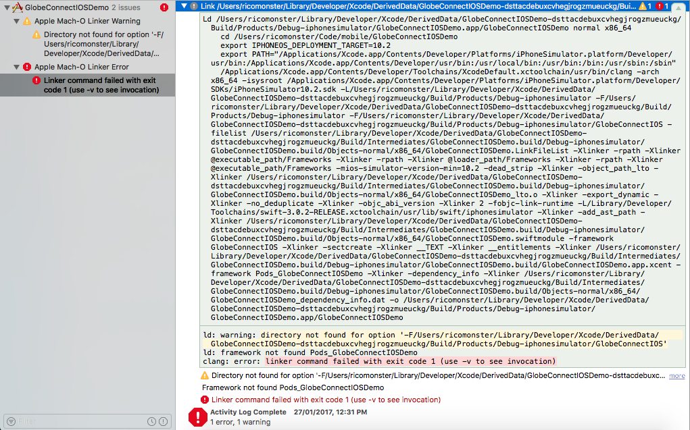
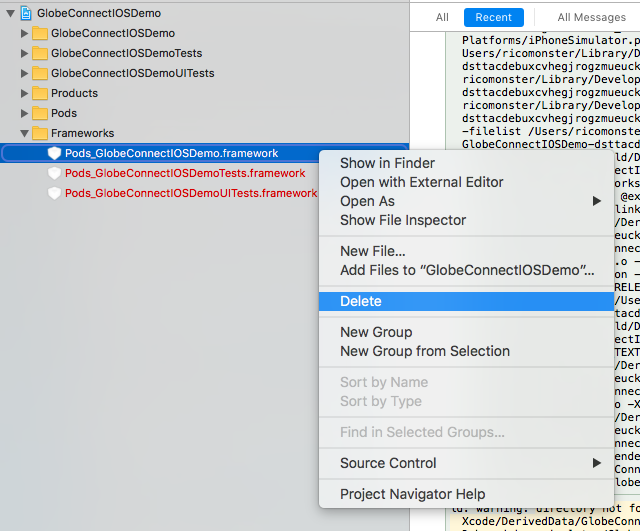
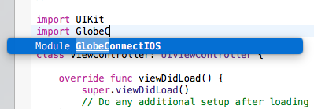

# Installing the SDK via Cocoapods.

Below are the step by step procedure on how to install the sdk via Cocoapods on your new or
existing project manually, below also shows the list of the requirements for the sdk to work properly.

## Requirements

- XCode >= 8
- Swift >= 3.0
- Cocoapods

#### Step 1. Installation

Make sure you have Cocoapods installed in your machine but if you don't have here is a quick
tutorial on [how to install Cocoapods](https://guides.cocoapods.org/using/getting-started.html).

Once you have Cocoapods installed, create a new XCode project. If you have created or have an
existing project fire up your terminal and `cd` to your project then type `pod init` to setup
a `Podfile` in your project directory.

Open up your browser and go to [Cocoapods page of the SDK](https://cocoapods.org/pods/GlobeConnectIOS)
and look up for the installation guide.

Follow the instructions and once you have fired up `pod install` your output should be like this to
confirm that you have successfully installed the SDK.

#### Step 2. Setting the SDK as a Project Dependency

Open up the project in XCode and the first thing you need to do is to build the project by hitting
`Cmd + B`.

You might encounter an error like this:

The error is caused by a file which is not found and in order to fix the error, delete the said file
and build it again.

To make sure that the SDK is included, open any file in your project and type `import
GlobeConnectIOS`. XCode should auto-suggest the module just like this:

