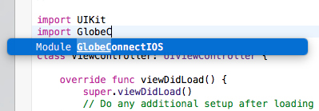

# Installing the SDK Manually via the SDK Builder.

Below are the step by step procedure on how to install the sdk on your new or existing project manually, below also shows the list of the requirements for the sdk to work properly.

## Requirements

- XCode >= 8
- Swift >= 3.0

#### Step 1. Go to the SDK Builder page.

For the first step, we need to download the sdk via the sdk builder site located at [globelabs.github.io](http://globelabs.github.io), select the platform and the api's that needs to be included in the sdk, in this case the platform that we need to use is iOS, after downloading the zip file that contains the sdk via the sdk builder site extract it then let's proceed to the next step where we are going to import the sdk to a new / existing XCode project.

### Step 2. Including the SDK to the project.

Extract the SDK zip file and make sure that there is a `.xcodeproj` file. In order to use this
to your project, you can drag-and-drop the `.xcodeproj` file to your project navigator in XCode
parallel to your project.

Step 3. Setting the SDK as Project Dependency.

To set the SDK as a Project Dependency you need to link the framework to your project. Select your
project and go to **General** and look for **Linked Frameworks and Libraries**. Click add and make the
`GlobeConnectIOS.framework` should be there like this:

To make sure that the framework is included hit `Cmd + B` to build the project and open any file
in your project and type `import GlobeConnectIOS`. XCode should auto-suggest the module just like
this:

