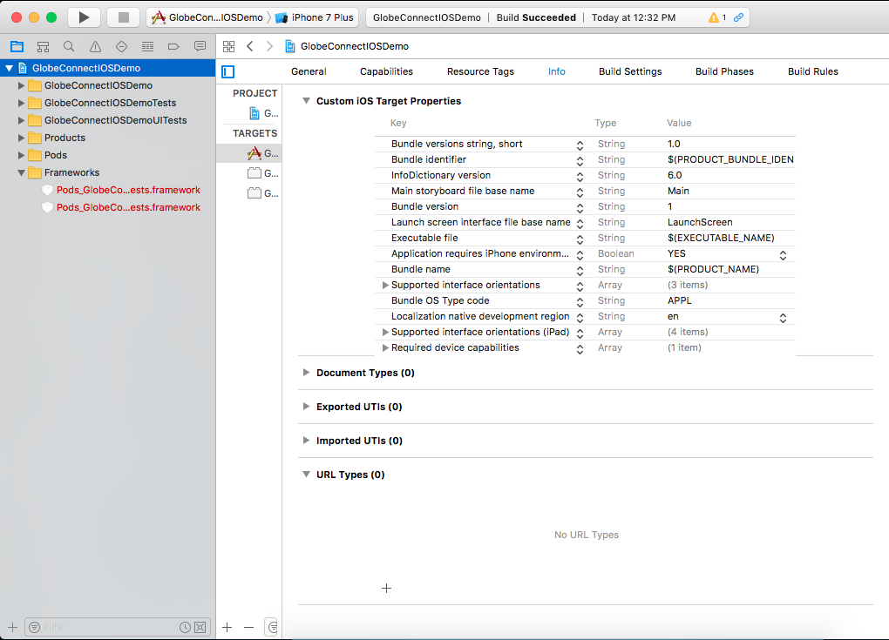
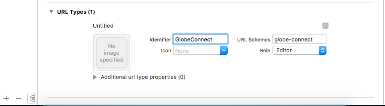

# Setting up URL Schemes

Below are the steps on how to setup URL Schemes. This is a very important setup for the
Authentication process.

#### Setting up

Select your project in XCode and select **Info** and look for **URL Types**.


Click the add button and fillup the **Identifier** field and the **URL Schemes** field.


#### Server-side Redirect

Make sure when after Globe redirects you to your given url, check if the requests came from
the device and get the generated code from the URL then redirect again using your url scheme.

Example in PHP:

```php
<?php

if (strpos($_SERVER['HTTP_USER_AGENT'], 'iPhone')) {
    // redirect
    header('Location: globe-connect://redirect?code='.$_GET['code']);
}
```
